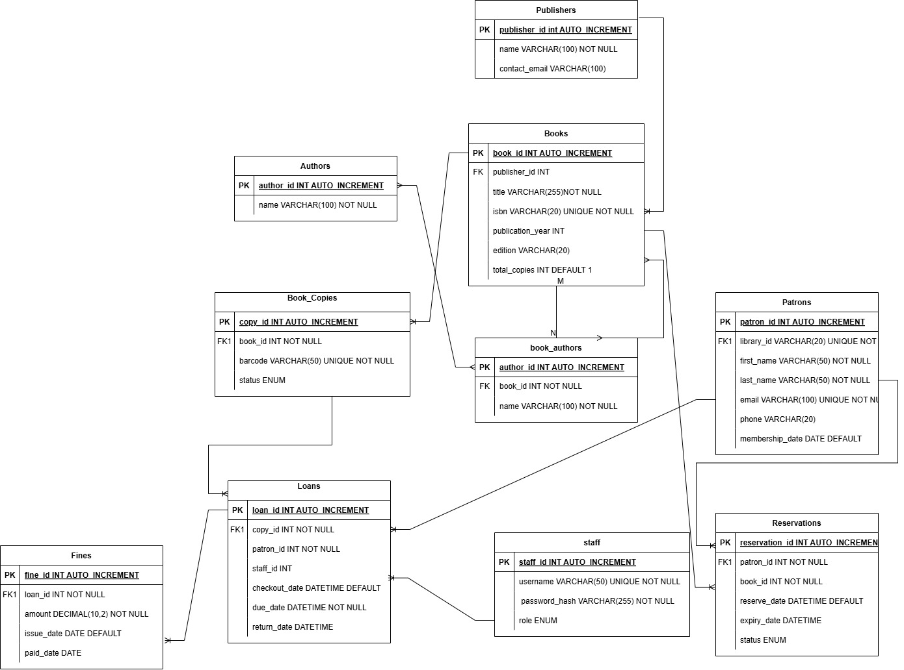

# PLP-2025-Database-Final-Project
## Library Management System
## MySQL Database Implementation
📌 Project Description
This project is a Library Management System built entirely with MySQL.  
This MySQL library database tracks everything from books and authors   
to members and loans, using tables for publishers, books, book copies,   
authors, patrons, staff, loans, reservations, and fines. It handles   
real-world library tasks like checking out books (with due dates),   
placing holds, and calculating late fees while keeping data organized   
and error-free with smart rules.  

It includes:  
✅ Database schema with tables  
✅ Proper constraints (PK, FK, NOT NULL, UNIQUE)  
✅ Well-commented SQL for easy understanding  

📂 Repository Structure 
library-management-db/ 
├── library_schema.sql   # Complete SQL script (tables)  
└── README.md            # This guide

## 🔧 How to Set Up the Database  
1. Create the Database  
   Run this in MySQL:
   CREATE DATABASE library_management;  
   USE library_management;  
     
2. Import Schema
   Run the library_schema.sql file:
   mysql -u root -p library_management < library_schema.sql

3. Verify Tables
  SHOW TABLES;  

## Entity Relationship Diagram (ERD)
  

##📊 Database Schema Details
📜 library_schema.sql(Tables)  
📚Core Entities  
-publishers-Stores publisher details for book acquisition.  
-books-Stores book metadata and inventory counts.  
-book_copies-Manages physical copies of books. (barcodes, status)  
-authors-Stores author information.  
-book_authors-Junction table for books with multiple authors.  
 
📚User management  
-patrons-Tracks library members and their contact details.  
-staff-	Manages library staff accounts and roles.  

📚Transactions  
-loans- Logs all book loans with automatic date validation.  
-reservations-Handles book hold requests from patrons.  
-fines-Tracks late fees for overdue books.  

## 📚Key Relationships
Books → Book Copies: 1-to-Many (One book → Many physical copies)  
Books ↔ Authors: Many-to-Many (Via book_authors)  
Patrons → Loans: 1-to-Many (One patron → Many loans)  
Book Copies → Loans: 1-to-Many (One copy → Many loans over time)  
Loans → Fines: 1-to-Many (One loan → Multiple fines if overdue)  

🔍 Key Features  
✔ Data Integrity – Constraints prevent invalid data (e.g., available_copies ≤ total_copies)  
✔ Auto-increment IDs – No manual ID management  
✔ Default Values – membership_date, borrow_date, and status set automatically  

🚀 How to Use  
✅Clone the repo:  
git clone (https://github.com/flumadi/PLP-2025-Database-Final-Project)

✅Import into MySQL:  
mysql -u root -p library_management < library_schema.sql  

✅Query the database:  
sql  
-- Example: Check available books  
SELECT * FROM books WHERE available_copies > 0;  

##For any or further inquiries about the same feel free to contact for assistance on [mathiasfridah2@gmail.com]  
🧑‍💻Happy coding!!  
